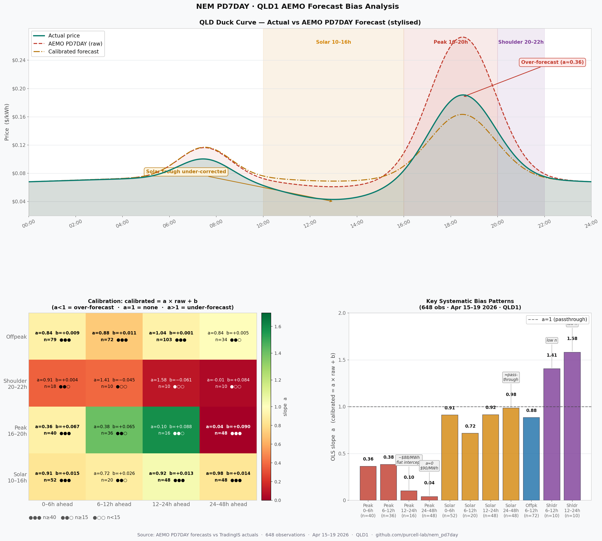
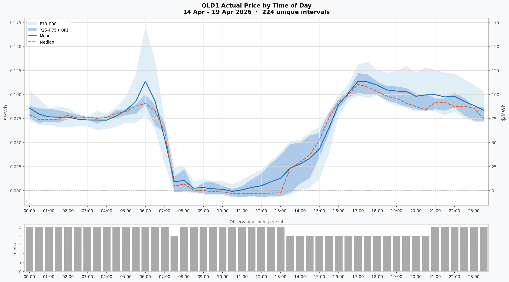

# NEM PD7DAY Price Forecast — Home Assistant Integration

[](https://github.com/hacs/integration)
[](https://www.home-assistant.io/)
[](https://github.com/purcell-lab/nem_pd7day/releases)

A Home Assistant custom integration that fetches AEMO's **7-day ahead electricity price forecasts** (PD7DAY) for the National Electricity Market (NEM) and exposes them as HA sensors with machine-learning calibration.

AEMO publishes PD7DAY three times per day (07:30, 13:00, 18:00 AEST). This integration fetches those updates on the same schedule and applies an on-device calibration layer — using your local history of forecast vs actual prices — to produce calibrated estimates with P10/P50/P90 confidence bands.

---

## Features

- **7-day price forecast** — calibrated $/kWh with P10/P50/P90 confidence bands
- **Isotonic calibration** — monotone PAV regression bias correction fitted on actual TradingIS vs PD7DAY pairs, with per-bucket compression ratio, iso_mae, and P10/P90 confidence intervals
- **Interconnector flows** — interconnector MW flow forecasts for the configured region
- **Market intervention flag** — binary sensor from CASESOLUTION data
- **Calibration diagnostic** — observation count, active bucket count, fit quality per bucket
- **Live charts** — two camera entities updated after each refit:
  - **Price ToD Chart** — actual price by time of day (mean, median, P10–P90 spread across all observed intervals)
  - **Calibration Chart** — isotonic calibration goodness dashboard: compression ratio heatmap, iso_mae bars, PAV complexity scatter, and compression ratio drift time-series
- **Cloud polling** — two independent polling loops:
  - **PD7DAY** fetches at AEMO publish times: 07:30, 13:00, 18:00 AEST (3 requests/day)
  - **TradingIS** fetches actual 5-min dispatch prices every 30 minutes (48 requests/day)
- **Live sensor state** — all forecast sensor states advance automatically every 30 minutes to reflect the current interval, with no fetch required
- **No third-party accounts required** — actual prices sourced directly from AEMO TradingIS
- **Dependencies** — `matplotlib`, `numpy` for chart rendering, `astral` for solar elevation (installed automatically by HACS/HA)

---

## Requirements

- Home Assistant 2024.1 or later
- Network access to `www.nemweb.com.au`

---

## Installation

### Via HACS (recommended)

1. Open HACS in your HA instance
2. Go to **Integrations → Custom repositories**
3. Add `https://github.com/purcell-lab/nem_pd7day` with category **Integration**
4. Search for **NEM PD7DAY** and install
5. Restart Home Assistant
6. Go to **Settings → Devices & Services → Add Integration** and search for **NEM PD7DAY**

### Manual

1. Download the latest release zip from the [Releases page](https://github.com/purcell-lab/nem_pd7day/releases)
2. Extract `custom_components/nem_pd7day/` into your HA config directory
3. Restart Home Assistant
4. Go to **Settings → Devices & Services → Add Integration** and search for **NEM PD7DAY**

---

## Configuration

The integration is configured via a single-step UI flow.

| Field | Default | Description |
|---|---|---|
| NEM Region | QLD1 | The NEM region to monitor: `QLD1`, `NSW1`, `VIC1`, `SA1`, or `TAS1` |

The configured region is used for both price forecasting and calibration. No additional settings are required.

No `configuration.yaml` entries are required.

### Monitoring multiple regions

Each integration instance monitors one NEM region with full independent calibration. To monitor multiple regions, add a separate integration instance for each via **Settings → Integrations → Add Integration → NEM PD7DAY**. Each instance maintains its own calibration store, observation log, and forecast sensors.

### Upgrading from v2.0.0–v2.0.2

Those versions supported multi-region configuration. From v2.0.3 onwards exactly one region is configured per integration instance. On upgrade, only the first region from a previous multi-region list is preserved — the integration migrates automatically. To reinstate additional regions, add new integration instances as described above.

### Recorder exclusion (recommended)

The forecast sensors carry large attribute payloads (7 days × 48 intervals). Add the following to `configuration.yaml` to prevent recorder warnings and database bloat:

```yaml
recorder:
  exclude:
    entity_globs:
      - sensor.pd7day_*_ic_*
      - sensor.*_pd7day_forecast
```

---

## Data sources and polling

The integration runs two independent polling loops.

### PD7DAY forecasts (3×/day)

AEMO publishes 7-day ahead price forecasts three times per day. The integration fetches on the same schedule using `async_track_point_in_utc_time`:

| NEM time (AEST) | UTC |
|---|---|
| 07:30 | 21:30 (previous day) |
| 13:00 | 03:00 |
| 18:00 | 08:00 |

Source: [AEMO NEMWeb PD7DAY](https://www.nemweb.com.au/REPORTS/CURRENT/PD7Day/)

### TradingIS actual prices (every 30 minutes)

Actual NEM dispatch prices are fetched from AEMO's TradingIS reports and used to build calibration observations:

- **URL**: `https://www.nemweb.com.au/REPORTS/CURRENT/TradingIS_Reports/`
- **Schedule**: at HH:02 and HH:32 NEM time — 2 minutes after each 30-minute trading interval closes
- **Method**: downloads the 6 × 5-minute dispatch files for the closed interval, averages the RRP values ($/MWh → $/kWh)
- **Observation tagging**: each calibration observation records `actual_source: "tradingis"`

### Sensor state updates (every 30 minutes)

Forecast sensor states — price forecast and interconnector flow — advance automatically at each 30-minute interval boundary (:00 and :30 past every hour). The state always reflects the current interval from the most recent fetch, without waiting for the next PD7DAY fetch. This means:

- After the 07:30 fetch, the price forecast sensor state will step through each 30-minute interval for the rest of the day
- After HA restart, the state reflects the current interval immediately on load
- Between fetches, the raw forecast data is unchanged — only the *active interval* advances

---

## Sensors

All sensors are grouped under a single HA device named **NEM PD7DAY {region}** (e.g. `NEM PD7DAY QLD1`).

### Price Forecast

`sensor.nem_pd7day_{region}_price_forecast` — the primary calibrated price forecast sensor.

| Attribute | Description |
|---|---|
| `state` | Calibrated price for the current interval ($/kWh) |
| `region` | NEM region code |
| `forecast_generated_at` | ISO-8601 timestamp of the AEMO source file |
| `forecast` | List of all forecast periods (see below) |
| `next_value` | Calibrated price for the next interval |
| `min_24h_value` | Minimum calibrated price in the next 24 hours |
| `max_24h_value` | Maximum calibrated price in the next 24 hours |
| `cheapest_2h_window` | Best contiguous 2-hour window over 7 days |

Each entry in `forecast` contains:

```yaml
nemtime: "2026-04-15T17:30:00+10:00"   # interval END (AEMO convention)
time:    "2026-04-15T17:00:00+10:00"   # interval START
raw_value: 0.084                        # raw AEMO forecast ($/kWh)
calibrated: 0.142                       # isotonic-calibrated value
p10: 0.091                             # 10th percentile (optimistic)
p50: 0.138                             # 50th percentile (median)
p90: 0.231                             # 90th percentile (conservative)
ols_mae: 0.038                         # mean absolute error of calibration fit
calibrated_source: isotonic            # "isotonic", "passthrough_high", "passthrough_sanity", or "passthrough"
n_obs: 147                             # observations used for this bucket
horizon_hours: 36.5                    # hours ahead
value: 0.142                           # alias for calibrated (template compat)
```

> **Timestamp convention**: `nemtime` is the interval END timestamp as published by AEMO. `time` is the interval START (`nemtime − 30 minutes`). This matches the AEMO dispatch interval convention.

---

---

### Interconnector Flow

`sensor.pd7day_{region}_ic_{interconnector}` — one sensor per interconnector touching the configured region.

| Attribute | Description |
|---|---|
| `state` | Current period MW flow (positive = export) |
| `interconnector_id` | Interconnector identifier |
| `forecast` | List of forecast periods with `nemtime`, `time`, `mw` |

Default interconnectors per region:

| Region | Interconnectors |
|---|---|
| QLD1 | NSW1-QLD1, N-Q-MNSP1 |
| NSW1 | NSW1-QLD1, VIC1-NSW1, N-Q-MNSP1 |
| VIC1 | VIC1-NSW1, SA1-VIC1, V-S-MNSP1, T-V-MNSP1 |
| SA1 | V-SA, V-S-MNSP1 |
| TAS1 | T-V-MNSP1 |

---

### Market Intervention

`binary_sensor.nem_pd7day_{region}_intervention` — `ON` when AEMO has flagged a market intervention in the CASESOLUTION data. Under normal market conditions this is `OFF`.

---

### Calibration

`sensor.nem_pd7day_{region}_calibration` — calibration system diagnostic. This sensor is in the **Diagnostic** category and is hidden from the default HA dashboard (visible under the device's Diagnostic section).

| Attribute | Description |
|---|---|
| `state` | Total observations logged |
| `active_buckets` | Buckets with ≥ 20 observations (max 24) |
| `total_buckets` | 24 (6 horizons × 4 time-of-day labels) |
| `fitted_at` | ISO-8601 timestamp of last model refit |
| `summary` | Per-bucket isotonic diagnostics: n, iso_n_steps, compression_ratio, iso_mae, x_min, x_max, q10_a, q90_a |

#### Forecast history attributes

| Attribute | Description |
|---|---|
| `forecast_history_entries` | Total forecast entries stored across all tracked intervals |
| `forecast_history_intervals` | Number of unique interval keys in storage |
| `forecast_history_oldest` | ISO-8601 timestamp of the oldest tracked interval |
| `forecast_history_newest` | ISO-8601 timestamp of the most recent tracked interval |
| `forecast_history_runs_avg` | Average number of forecast runs per interval |

Use these to verify h48_96/h96plus buckets are accumulating — `forecast_history_entries` should grow by ~3 per interval per day (one entry per AEMO fetch).

---

### Price ToD Stats

`sensor.nem_pd7day_{region}_price_tod_stats` (Diagnostic) — current 30-minute slot's mean actual price ($/kWh), with full 48-slot statistics as attributes.

| Attribute | Description |
|---|---|
| `state` | Mean actual $/kWh for the current time-of-day slot |
| `unique_intervals` | Total unique intervals with actuals |
| `date_from` / `date_to` | Date range of recorded actuals |
| `slots` | List of 48 dicts — one per 30-min slot, each with `mean_kwh`, `median_kwh`, `p10_kwh`, `p25_kwh`, `p75_kwh`, `p90_kwh`, `n` |

---

### Source File Datetime / Data Updated

- `sensor.nem_pd7day_{region}_source_file_datetime` — timestamp of the latest AEMO PD7DAY source file
- `sensor.nem_pd7day_{region}_data_updated` — timestamp of the last coordinator data refresh

Both are diagnostic sensors (EntityCategory.DIAGNOSTIC) and do not appear on the default dashboard.

---

### Camera Entities

Two camera entities are registered on the device and can be added to any HA dashboard using a **Picture** or **Camera** card.

| Entity | Description |
|---|---|
| `camera.nem_pd7day_{region}_price_tod_chart` | Actual price by time of day — mean, median, and P10–P90 spread across all observed intervals |
| `camera.nem_pd7day_{region}_calibration_chart` | Isotonic calibration goodness dashboard: compression ratio heatmap, iso_mae bars, PAV complexity scatter, and compression ratio drift time-series |
| `camera.nem_pd7day_{region}_forecast_chart` | 7-Day Pre-Dispatch Spot Price Forecast — raw vs calibrated with p10/p90 confidence band, per-day min/max labels, spike annotations |

Both charts are re-rendered after each calibration refit (07:30, 13:00, 18:00 NEM). The calibration chart reads live isotonic diagnostics so the heatmap values, n counts and confidence indicators update as calibration matures.

---

## Calibration System

The calibration system corrects the known bias in AEMO's PD7DAY forecasts using your local history of forecast vs actual wholesale prices.

### How it works

1. **Forecast ingestion** — each fetch logs the forecast price for every future interval into persistent storage, keyed by interval start time
2. **Actual logging** — at HH:02 and HH:32, TradingIS dispatch prices are fetched from AEMO and logged against the just-closed interval
3. **Matching** — when both forecast and actual exist for an interval, an observation pair is created
4. **Bucketing** — observations are grouped into 24 buckets by horizon and time-of-day:

| Horizon buckets | Time-of-day buckets |
|---|---|
| `h00_06` — 0 to 6 hours ahead | `peak` — NEM 16:00–21:00 (hardcoded) |
| `h06_12` — 6 to 12 hours | `solar` — sun elevation > 15° and not peak |
| `h12_24` — 12 to 24 hours | `morning_ramp` — sun elevation 0°–15° and not peak |
| `h24_48` — 24 to 48 hours | `shoulder` — sun below horizon (elevation ≤ 0°) |
| `h48_96` — 48 to 96 hours | |
| `h96plus` — beyond 96 hours | |

   Time-of-day classification uses **solar elevation angle** (via the `astral` library with capital city coordinates for each NEM region) instead of fixed clock-hour boundaries. This tracks the seasonal shift in the solar generation window (~1–2 hours between summer and winter) and naturally captures the duck curve inflection points.

5. **Isotonic (PAV) fitting** — once a bucket has ≥ 20 observations, a monotone isotonic regression (Pool Adjacent Violators) is fitted using exponential time decay weighting (`weight = exp(-0.033 × days_ago)`, half-life ≈ 21 days). Separate P10 and P90 quantile slopes are also fitted. Key diagnostics per bucket:
   - `compression_ratio` — (y_max − y_min) / (x_max − x_min); values <1 indicate AEMO over-forecasts
   - `iso_mae` — mean absolute calibration shift |y_fitted − x_raw|
   - `iso_n_steps` — number of distinct steps in the fitted isotonic function (complexity)
   - `q10_a` / `q90_a` — quantile slopes driving P10/P90 confidence intervals

6. **Application** — at forecast time, each period's bucket is looked up. If active, isotonic and quantile values are returned. Otherwise the raw value passes through unchanged.

### ToD classification details

The integration classifies each 30-minute NEM interval into one of four time-of-day buckets based on solar elevation angle (using the `astral` library with the capital city coordinates for each NEM region — Brisbane, Sydney, Melbourne, Adelaide, Hobart):

| Label | Condition | Typical NEM hours |
|---|---|---|
| `peak` | NEM hour 16–21, unconditional | 16:00–21:00 |
| `solar` | elevation > 15° and not peak | ~09:00–16:00 |
| `morning_ramp` | elevation 0°–15° and not peak | ~05:00–09:00 |
| `shoulder` | elevation ≤ 0° (overnight) | ~21:00–05:00 |

**Why solar elevation instead of clock hours?**
- The solar generation window shifts by ~1–2 hours between summer and winter
- Clock-hour buckets cannot capture this seasonal drift
- Solar elevation naturally tracks the duck curve inflection points
- `morning_ramp` captures the pre-solar demand spike (gas peakers, morning load) that behaves very differently from true overnight prices

**Why morning_ramp matters:**
The 05:00–09:00 NEM window has materially different price dynamics from true overnight — demand climbs fast, gas peakers fire, and solar hasn't started yet. Previous clock-hour buckets lumped this into "offpeak", causing systematic upward bias in that window. The `morning_ramp` bucket captures this independently.

### Isotonic decay weighting

Each isotonic bucket fit uses exponential time decay weighting:
- `weight = exp(-0.033 × days_ago)` — half-life ≈ 21 days
- Observations from 21 days ago have half the influence of today's observations
- Observations from 90 days ago have ~5% influence (near zero)
- This allows the model to adapt to seasonal price dynamics, changing generation mix, and week-to-week market shifts without discarding historical data

### Bucket structure

4 ToD labels × 6 horizon bands = 24 active buckets per region. Minimum 20 observations required per bucket before it activates. New installs will see buckets activate progressively over the first few days.

### AEMO forecast bias — QLD empirical findings



The chart above shows three panels derived from 648 forecast vs actual observation pairs collected over the first five days of operation (Apr 15–19 2026, QLD1):

**Panel 1 — Duck curve**: The stylised QLD wholesale price profile. Actual prices follow the classic duck curve shape — a solar-driven trough around 13:00 and a sharp evening ramp as rooftop solar drops off and demand peaks around 18:30. AEMO's raw PD7DAY forecast over-estimates the evening peak height and under-corrects the solar trough depth. The calibrated forecast applies the isotonic correction to bring both in line.

**Panel 2 — Compression ratio heatmap**: Each cell shows the `compression_ratio` for that horizon × time-of-day bucket. Green (compression_ratio≈1) means AEMO's forecast is unbiased. Red (compression_ratio<1) means AEMO over-forecasts and the calibration compresses the signal. Yellow-green (compression_ratio>1) means AEMO under-forecasts. Confidence indicators show observation count: ●●● (n≥40), ●●○ (n≥15), ●○○ (n<15).

**Panel 3 — Key bias patterns**: The most actionable signals after five days of data.

### Observed actual prices by time of day



This chart is generated from the rolling observation log and updated after each refit. Each 30-minute slot shows the mean and median actual price, with P10–P90 spread bands. The solar window (typically 10:00–15:00) frequently shows negative or near-zero prices. The bar chart below shows how many actuals have been recorded per slot — slots with fewer observations (n<10) have wider, less reliable bands.

The consistent structural patterns emerging from the data:

| Pattern | Buckets | Observed | Interpretation |
|---|---|---|---|
| Strong over-forecast | `h00_06__peak`, `h06_12__peak` | compression_ratio ≈ 0.36–0.38 | AEMO over-forecasts evening peak at short horizons; calibration reduces to ~37% of raw signal |
| Flat intercept | `h12_24__peak`, `h24_48__peak` | compression_ratio ≈ 0.10, 0.04 | AEMO peak forecasts beyond 12h carry near-zero information — calibration collapses to a near-constant value |
| Solar over-forecast | `h00_06__solar` through `h12_24__solar` | compression_ratio ≈ 0.72–0.91 | Modest compression; converges to near-passthrough at h24_48 (compression_ratio≈0.985) |
| Near-passthrough | `h06_12__offpeak` | compression_ratio ≈ 0.88 | AEMO offpeak 6–12h forecasts are well-calibrated |
| Mild under-forecast | `h12_24__offpeak` | compression_ratio ≈ 1.04 | Slight upward correction for mid-range offpeak horizons |
| Shoulder anomaly | `h06_12__shoulder`, `h12_24__shoulder` | compression_ratio ≈ 1.41–1.58 | AEMO under-forecasts shoulder (20:00–22:00) persistence; n=10, provisional |

The flat `compression_ratio` at `h96plus__peak` (cr≈0.048) confirms the raw AEMO long-range peak forecast contains essentially no predictive information — isotonic calibration correctly flattens the output to a near-constant value.

### Warm-up period

With 3 fetches per day and MIN_OBS=20, expect:

| Day | Buckets active | Coverage |
|---|---|---|
| 1–5 | 0 | All passthrough |
| 5–7 | h00_06, h06_12, h12_24 | Near-term calibrated |
| 8–10 | h24_48 | 2-day horizon calibrated |
| 12–16 | h48_96, h96plus | Full 7-day calibration |

### Storage files

| File | Contents |
|---|---|
| `nem_pd7day.{region}.observation_log` | Calibration observations for the configured region |
| `nem_pd7day.{region}.calibration_coefficients` | Fitted isotonic and quantile models for the configured region |
| `nem_pd7day.{region}.forecast_history` | Forecast history for the configured region |

e.g. for QLD1: `nem_pd7day.qld1.observation_log`

> **Upgrading from v2.0.3 or earlier?** Storage files are automatically migrated to the region-scoped naming on first load. Your existing observations and calibration coefficients are preserved.

To reset calibration (e.g. after changing region):

```bash
rm /config/.storage/nem_pd7day.qld1.observation_log
rm /config/.storage/nem_pd7day.qld1.calibration_coefficients
rm /config/.storage/nem_pd7day.qld1.forecast_history
```

Then reload or restart the integration.

---

## Template Sensor Examples

The `value` key in each forecast period is an alias for `calibrated` (or `raw_value` in passthrough), maintained for backward compatibility.

### Next 24-hour minimum price

```yaml
template:
  - sensor:
      - name: "PD7DAY Min Price 24h"
        unit_of_measurement: "$/kWh"
        state: >
          {{ state_attr('sensor.nem_pd7day_qld1_price_forecast', 'min_24h_value') | round(4) }}
```

### Cheapest 2-hour window start time

```yaml
template:
  - sensor:
      - name: "PD7DAY Cheapest Window Start"
        state: >
          {{ state_attr('sensor.nem_pd7day_qld1_price_forecast', 'cheapest_2h_window')['time'] }}
```

### Current calibrated price as a buy cost

```yaml
template:
  - sensor:
      - name: "QLD1 PD7DAY Buy Cost"
        unit_of_measurement: "$/kWh"
        state: >
          
          
            {{ forecast[0]['calibrated'] | round(4) }}
          
            unavailable
          
```

---

## NEM Time Convention

All timestamps in this integration use **AEST (UTC+10:00)** with no daylight saving adjustment, matching AEMO's published data. Timestamps are always ISO-8601 with explicit `+10:00` suffix, e.g. `2026-04-14T07:30:00+10:00`.

The `nemtime` field in forecast periods is the **interval end** timestamp (AEMO convention). The `time` field is the **interval start** (`nemtime − 30 minutes`).

---

## Troubleshooting

### Integration fails to load

Check the HA log for errors from `custom_components.nem_pd7day`. The most common cause is a network issue reaching `nemweb.com.au`.

### Sensors show `unavailable`

The first fetch runs at integration load. Check **Settings → System → Logs** filtered to `nem_pd7day` for fetch errors.

### p10/p50/p90 values are `null`

Normal for the first 5–7 days. Calibration requires at least 20 observations per bucket. Check the `Calibration` sensor state for current observation count.

### h48_96 / h96plus buckets show n=0

These buckets require observations from intervals 2–4 days ahead. They begin accumulating approximately 48 hours after first install (or after upgrading from a version prior to v1.9.1 which fixed forecast history persistence).

### Recorder warnings about attribute size

Add the recorder exclusions shown in the [Configuration](#configuration) section.

### QLD1 (or any region) price forecast showing flat line / not updating

This occurs when HA's entity registry has a stale `entity_id` from a previous version registration. SA1 installs are unaffected as they were registered after the fix. To resolve:

1. Go to **Settings → Devices & Services → NEM PD7DAY [region]** device
2. Delete or disable/re-enable each affected entity
3. Restart HA — entities re-register with correct IDs

> **Note:** historical data for the affected entity will restart from the re-registration date. This is a one-time migration step.

---

## Version History

| Version | Changes |
|---|---|
| 2.3.12 | Chart improvements: per-cluster spike callouts, anti-crossover arrow placement, chart title updated to 7-Day Pre-Dispatch Spot Price Forecast, x-axis ticks at 06:00/18:00 only, MSL/LOR notice staggered labels and legend patches |
| 2.3.x | Multiple fixes: matplotlib thread-safety (OO API), Grid Notices sensor device attachment, p10/p90 None crash, blocking event loop calls, sanity check log spam |
| 2.3.0 | MSL/LOR grid stress notices: NEMWEB poller, HA .storage persistence, 7-day chart annotation bands (LOR1/2/3, MSL1/2/3), Grid Stress binary sensor, Grid Notices count sensor |
| 2.2.11 | Sanity guard tuning: SANITY_RATIO_RAW_FLOOR=0.05 $/kWh floor + SANITY_ABS_DIFF_LIMIT=0.30 $/kWh absolute backstop to prevent false positives on near-zero raw forecasts |
| 2.2.10 | Isotonic calibration: replaced weighted OLS with PAV monotone isotonic regression; per-bucket compression_ratio, iso_mae, iso_n_steps diagnostics; iso_chart camera; unconditional startup refit |
| 2.2.4 | Critical fix: spike actual prices (actual_rrp >= $3.00/kWh) were not being excluded from OLS training buckets — only the forecast passthrough path applied SPIKE_THRESHOLD. The 05 May spike event ($8,000–$15,000/MWh actuals) collapsed all medium/long-horizon peak and shoulder slopes to near zero. Fix is retrospective — call nem_pd7day.force_refit after updating to immediately restore correct coefficients. |
| 2.2.3 | Fix: adding a second NEM region failed with "This region is already configured" — config entry unique_id is now region-scoped (nem_pd7day_{region}) instead of hardcoded |
| 2.2.2 | New 7-day forecast chart camera entity per region — shows raw vs calibrated forecast with p10/p90 confidence band, per-day min/max labels ($/kWh), dual $/kWh + $/MWh y-axes, dynamic clip at p99+15% headroom, passthrough_high spike annotations; fix circular import chain through `__init__.py` (`now_nem`/`to_nem_iso` removed from `calibration_engine` imports); fix CI workflow — `astral`, `numpy`, `matplotlib` now installed in test runner; fix spike forecast callout label in $/kWh not $/MWh |
| 2.2.1 | Fix `total_buckets` sensor attribute (was hardcoded 18, now derived dynamically as `len(TOD_LABELS) × len(HORIZON_BANDS)` = 24); add `nem_pd7day.force_refit` service — triggers immediate calibration refit and coordinator refresh for one or all regions without waiting for the next scheduled fetch; fix GitHub Actions CI workflow — install `astral`, `numpy`, `matplotlib` in test runner |
| 2.2.0 | Adaptive Calibration — weighted OLS with exponential time decay (λ=0.033, half-life≈21d); solar elevation angle ToD classification via `astral` (peak/solar/morning_ramp/shoulder); 4 labels × 6 horizon bands = 24 active buckets; `astral>=2.2` dependency |
| 2.1.3 | Version bump |
| 2.1.2 | Multi-region audit: remove hardcoded `entity_id` from Gas sensor; drop Gas Generation Forecast sensor (not relevant to regional price forecasting) |
| 2.1.1 | Multi-region fix: add `name=` to camera and ToD Stats sensor `device_info` so HA generates correctly scoped entity IDs per region |
| 2.1.0 | Multi-region support: region-scoped `unique_id` and `device_info` for all entities; real ToD curves in bias chart (actual / AEMO raw / calibrated); `calibration_result` passed into `tod_stats.compute()` |
| 2.0.9 | Camera entities: Price ToD Chart (actual price by time of day) and Bias Chart (live duck curve + OLS heatmap); Price ToD Stats sensor; matplotlib + numpy dependencies |
| 2.0.8 | Fix 30-min sensor state advance (async lambda bug); spike passthrough at $3/kWh; 90-day rolling window; negative passthrough threshold -$0.10/kWh (solar trough correction) |
| 2.0.7 | Calibration: passthrough when raw <= 0 (negative price regime); clamp quantile slopes to 0 |
| 2.0.6 | Fix missing await on async_added_to_hass — sensors now register correctly on HA restart |
| 2.0.5 | Live sensor state advance (30-min intervals); gas_tj fix; calibration sensor → diagnostic; forecast history merged into calibration sensor |
| 2.0.4 | Region-scoped storage keys (multi-instance safe, auto-migration); gas_tj populated in forecast history |
| 2.0.3 | Single-region enforcement — one region per integration instance, full calibration coverage |
| 2.0.2 | Clean sensor names, remove Amber dependency, add Forecast History sensor |
| 2.0.1 | Version bump post-integration |
| 2.0.0 | Multi-region sensor support, TradingIS actual prices (no Amber required), forecast persistence |
| 1.9.1 | Forecast history persistence fix — h48_96/h96plus calibration buckets now survive HA restarts |
| 1.9.0 | Comprehensive pre-deployment test suite (107 tests) |
| 1.5.0 | AEMO interval convention: `nemtime` (end) + `time` (start) on all forecast periods |
| 1.4.0 | Timezone overhaul: all timestamps ISO-8601 +10:00, UTC-safe scheduling |
| 1.3.0 | Replaced polling with `async_track_point_in_utc_time` at AEMO publish times |
| 1.2.0 | OLS + IRLS quantile calibration engine, calibration diagnostic sensor |
| 1.1.0 | CASESOLUTION (binary sensor), MARKET_SUMMARY (gas), INTERCONNECTORSOLUTION sensors |
| 1.0.0 | Initial release: PRICESOLUTION forecast sensor |

---

## License

MIT License — see [LICENSE](LICENSE) for details.
