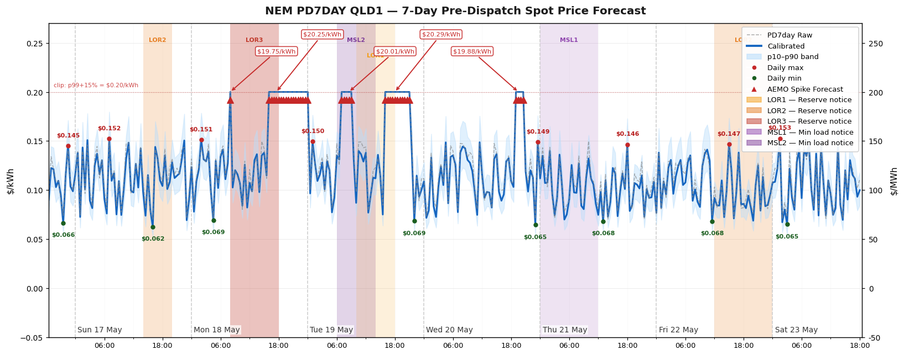

# NEM PD7DAY Price Forecast — Home Assistant Integration

[](https://github.com/hacs/integration)
[](https://www.home-assistant.io/)
[](https://github.com/purcell-lab/nem_pd7day/releases)

A Home Assistant custom integration that provides **days 2–7 electricity price and tariff forecasts** from AEMO's PD7DAY pre-dispatch data for the National Electricity Market (NEM). Designed to complement Amber Electric's 24-hour Express forecast, this integration covers the window beyond Amber's reach.

AEMO publishes PD7DAY three times per day (07:30, 13:00, 18:00 AEST). This integration fetches those updates on the same schedule and applies a two-stage on-device calibration pipeline — isotonic regression for bias correction, followed by an OLS correction using AEMO STPASA supply/demand features — to produce calibrated estimates with P10/P50/P90 confidence bands.

---

## How it works — Two-stage forecasting pipeline

The integration uses a two-stage forecasting pipeline:

- **Stage 1 — PD7DAY isotonic calibration**: AEMO's 7-day PD7DAY price forecasts are calibrated using isotonic regression fit on 60 days of rolling history. This corrects systematic bias and shapes the time-of-day profile across all horizons (h0–168).
- **Stage 2 — STPASA OLS correction** (horizons h22–h120): At medium-range horizons, an OLS model trained on AEMO STPASA supply/demand features (solar UIGF, wind UIGF, surplus capacity, demand 10/50/90) further corrects the isotonic output. Beyond h120, the model falls back to isotonic-only.

### Performance vs isotonic-only

- MAE improvement at h24–168: **−10.7%** vs isotonic alone (14.65 vs 16.06 $/MWh)
- Day-rank Spearman ρ: **0.917** vs 0.850
- Solar UIGF is the dominant STPASA signal (ρ = −0.78)

---

## Use Cases

- **Battery dispatch optimisation** — use the 7-day calibrated forecast and P10/P90 bands to schedule battery charge/discharge cycles beyond the Amber 24-hour window, minimising import cost and maximising export revenue at peak periods.
- **EV charging scheduling** — identify the cheapest 2-hour window over the next 7 days (`cheapest_2h_window` attribute) and trigger overnight EV charging at the lowest forecast price.
- **Hot water pre-heating** — use the `min_24h_value` attribute to trigger resistive hot water heating during forecast low-price windows (solar sponge periods).
- **Grid stress awareness** — the `grid_stress` binary sensor and grid notices count sensor provide advance warning of LOR/MSL events, allowing pre-emptive load shifting.
- **Linear programming dispatch** — feed the full `forecast` attribute list into an LP optimiser (e.g. EMHASS) as the price signal for multi-day horizon planning.
- **Tariff arbitrage** — use the network-aware tariff sensors (Energex, Ausgrid, etc.) for accurate import/export tariff forecasting that accounts for time-of-use network charges.

---

## Features

- **Days 2–7 price forecast** — calibrated $/kWh with P10/P50/P90 confidence bands, trimmed to the window beyond Amber Express
- **Isotonic calibration** — monotone PAV regression bias correction fitted on actual TradingIS vs PD7DAY pairs, with per-bucket compression ratio, iso_mae, and P10/P90 confidence intervals
- **Interconnector flows** — interconnector MW flow forecasts for the configured region
- **Market intervention flag** — binary sensor from CASESOLUTION data
- **Calibration diagnostic** — observation count, active bucket count, fit quality per bucket
- **Live charts** — two camera entities updated after each refit:
  - **Price ToD Chart** — actual price by time of day (mean, median, P10–P90 spread across all observed intervals)
  - **Calibration Chart** — isotonic calibration goodness dashboard: compression ratio heatmap, iso_mae bars, PAV complexity scatter, and compression ratio drift time-series
- **Cloud polling** — two independent polling loops:
  - **PD7DAY** fetches at AEMO publish times: 07:30, 13:00, 18:00 AEST (3 requests/day)
  - **TradingIS** fetches actual 5-min dispatch prices every 30 minutes (48 requests/day)
- **5-minute dispatch prices** — boundary-aligned `DispatchCoordinator` polls NEMWEB TradingIS at `:01:15`, `:06:15`, ..., `:56:15` (75 s after each dispatch boundary, after NEMWEB publishes). Used as the live `native_value` for tariff and spot sensors between 30-minute PD7DAY intervals.
- **Live sensor state** — all forecast sensor states advance automatically every 30 minutes to reflect the current interval, with no fetch required
- **No third-party accounts required** — actual prices sourced directly from AEMO TradingIS
- **Dependencies** — `matplotlib`, `numpy` for chart rendering, `astral` for solar elevation (installed automatically by HACS/HA)

---

## Requirements

- Home Assistant 2024.1 or later
- Network access to `www.nemweb.com.au`

---

## Installation

### Via HACS (recommended)

1. Open HACS in your HA instance
2. Go to **Integrations → Custom repositories**
3. Add `https://github.com/purcell-lab/nem_pd7day` with category **Integration**
4. Search for **NEM PD7DAY** and install
5. Restart Home Assistant
6. Go to **Settings → Devices & Services → Add Integration** and search for **NEM PD7DAY**

### Manual

1. Download the latest release zip from the [Releases page](https://github.com/purcell-lab/nem_pd7day/releases)
2. Extract `custom_components/nem_pd7day/` into your HA config directory
3. Restart Home Assistant
4. Go to **Settings → Devices & Services → Add Integration** and search for **NEM PD7DAY**

---

## Removal

1. Go to **Settings → Devices & Services**
2. Find **NEM PD7DAY** and click **⋮ → Delete**
3. Confirm deletion

This removes the integration and all its entities. Calibration storage files are not automatically deleted. To fully clean up, remove the following files from your HA config `.storage/` directory:

```bash
rm /config/.storage/nem_pd7day.{region}.observation_log
rm /config/.storage/nem_pd7day.{region}.calibration_coefficients
rm /config/.storage/nem_pd7day.{region}.forecast_history
rm /config/.storage/nem_pd7day.{region}.stpasa
```

Replace `{region}` with the lowercase region code (e.g. `qld1`, `nsw1`).

---

## Configuration

The integration is configured via a single-step UI flow.

| Field | Default | Description |
|---|---|---|
| NEM Region | QLD1 | The NEM region to monitor: `QLD1`, `NSW1`, `VIC1`, `SA1`, or `TAS1` |

The configured region is used for both price forecasting and calibration. No additional settings are required.

No `configuration.yaml` entries are required.

### Monitoring multiple regions

Each integration instance monitors one NEM region with full independent calibration. To monitor multiple regions, add a separate integration instance for each via **Settings → Integrations → Add Integration → NEM PD7DAY**. Each instance maintains its own calibration store, observation log, and forecast sensors.

### Recorder warnings (expected, harmless)

The forecast and tariff sensors carry large attribute payloads (7 days × 48 intervals each). Home Assistant will log warnings like:

```
State attributes for sensor.nem_pd7day_*_tariff exceed maximum size of 16384 bytes.
Attributes will not be stored
```

These warnings are **expected and harmless**. The sensor `state` value (the current $/kWh price) is always recorded and available in history — only the large `forecast` attribute list is dropped by the recorder. No configuration changes are needed.

> **Do not add `recorder: exclude: entity_globs`** for nem_pd7day sensors — doing so prevents the sensor state from being recorded, which breaks the history graph in the HA UI.

---

## Data sources and polling

The integration runs two independent polling loops.

### PD7DAY forecasts (3×/day)

AEMO publishes 7-day ahead price forecasts three times per day. The integration fetches on the same schedule using `async_track_point_in_utc_time`:

| NEM time (AEST) | UTC |
|---|---|
| 07:30 | 21:30 (previous day) |
| 13:00 | 03:00 |
| 18:00 | 08:00 |

Source: [AEMO NEMWeb PD7DAY](https://www.nemweb.com.au/REPORTS/CURRENT/PD7Day/)

### STPASA supply/demand outlook

The Stage 2 OLS correction is driven by AEMO's STPASA (Short-Term Projected Assessment of System Adequacy) feed, which provides the supply/demand outlook across all NEM regions in a single ZIP: solar UIGF, wind UIGF, surplus capacity, and demand 10/50/90 percentiles.

Source: [AEMO NEMWeb STPASA](https://www.nemweb.com.au/REPORTS/CURRENT/Short_Term_PASA_Reports/)

### TradingIS actual prices (every 30 minutes)

Actual NEM dispatch prices are fetched from AEMO's TradingIS reports and used to build calibration observations:

- **URL**: `https://www.nemweb.com.au/REPORTS/CURRENT/TradingIS_Reports/`
- **Schedule**: at HH:02 and HH:32 NEM time — 2 minutes after each 30-minute trading interval closes
- **Method**: downloads the 6 × 5-minute dispatch files for the closed interval, averages the RRP values ($/MWh → $/kWh)
- **Observation tagging**: each calibration observation records `actual_source: "tradingis"`

### Live dispatch prices (every 5 minutes, boundary-aligned)

5-minute dispatch prices for the sensor `native_value` are fetched from AEMO TradingIS on a boundary-aligned schedule:

- **URL**: `https://www.nemweb.com.au/Reports/Current/TradingIS_Reports/`
- **Schedule**: 75 seconds after each 5-minute UTC boundary (`:01:15`, `:06:15`, ..., `:56:15`). AEMO typically publishes 65–90 s after the interval boundary; 75 s sits within that window with margin (`_DISPATCH_POLL_DELAY_S = 75`).
- **Alignment**: uses `async_track_point_in_utc_time` with self-rescheduling one-shot callbacks — no drift from HA startup time.

### Sensor state updates (every 30 minutes)

Forecast sensor states — price forecast and interconnector flow — advance automatically at each 30-minute interval boundary (:00 and :30 past every hour). The state always reflects the current interval from the most recent fetch, without waiting for the next PD7DAY fetch. This means:

- After the 07:30 fetch, the price forecast sensor state will step through each 30-minute interval for the rest of the day
- After HA restart, the state reflects the current interval immediately on load
- Between fetches, the raw forecast data is unchanged — only the *active interval* advances

---

## Sensors

All sensors are grouped under a single HA device named **NEM PD7DAY {region}** (e.g. `NEM PD7DAY QLD1`).

### Spot Price Days 2-7

`sensor.nem_pd7day_{region}_price_forecast` — the primary calibrated spot price forecast sensor (days 2–7 only, trimmed to exclude the Amber Express window).

| Attribute | Description |
|---|---|
| `state` | Calibrated price for the current interval ($/kWh) |
| `region` | NEM region code |
| `forecast_generated_at` | ISO-8601 timestamp of the AEMO source file |
| `forecast` | List of all forecast periods (see below) |
| `next_value` | Calibrated price for the next interval |
| `min_24h_value` | Minimum calibrated price in the next 24 hours |
| `max_24h_value` | Maximum calibrated price in the next 24 hours |
| `cheapest_2h_window` | Best contiguous 2-hour window over 7 days |

Each entry in `forecast` contains:

```yaml
nemtime: "2026-04-15T17:30:00+10:00"   # interval END (AEMO convention)
time:    "2026-04-15T17:00:00+10:00"   # interval START
raw_value: 0.084                        # raw AEMO forecast ($/kWh)
calibrated: 0.142                       # isotonic-calibrated value
p10: 0.091                             # 10th percentile (optimistic)
p50: 0.138                             # 50th percentile (median)
p90: 0.231                             # 90th percentile (conservative)
ols_mae: 0.038                         # mean absolute error of calibration fit
calibrated_source: isotonic+stpasa     # "isotonic+stpasa" (h22–h120), "isotonic", "passthrough_high", "passthrough_sanity", or "passthrough"
n_obs: 147                             # observations used for this bucket
horizon_hours: 36.5                    # hours ahead
value: 0.142                           # alias for calibrated (template compat)
```

> **Timestamp convention**: `nemtime` is the interval END timestamp as published by AEMO. `time` is the interval START (`nemtime − 30 minutes`). This matches the AEMO dispatch interval convention.

---

---

### Interconnector Flow

`sensor.pd7day_{region}_ic_{interconnector}` — one sensor per interconnector touching the configured region.

| Attribute | Description |
|---|---|
| `state` | Current period MW flow (positive = export) |
| `interconnector_id` | Interconnector identifier |
| `forecast` | List of forecast periods with `nemtime`, `time`, `mw` |

Default interconnectors per region:

| Region | Interconnectors |
|---|---|
| QLD1 | NSW1-QLD1, N-Q-MNSP1 |
| NSW1 | NSW1-QLD1, VIC1-NSW1, N-Q-MNSP1 |
| VIC1 | VIC1-NSW1, SA1-VIC1, V-S-MNSP1, T-V-MNSP1 |
| SA1 | V-SA, V-S-MNSP1 |
| TAS1 | T-V-MNSP1 |

---

### Market Intervention

`binary_sensor.nem_pd7day_{region}_intervention` — `ON` when AEMO has flagged a market intervention in the CASESOLUTION data. Under normal market conditions this is `OFF`.

---

### Calibration

`sensor.nem_pd7day_{region}_calibration` — calibration system diagnostic. This sensor is in the **Diagnostic** category and is hidden from the default HA dashboard (visible under the device's Diagnostic section).

| Attribute | Description |
|---|---|
| `state` | Total observations logged |
| `active_buckets` | Buckets with ≥ 20 observations (max 24) |
| `total_buckets` | 24 (6 horizons × 4 time-of-day labels) |
| `fitted_at` | ISO-8601 timestamp of last model refit |
| `summary` | Per-bucket isotonic diagnostics: n, iso_n_steps, compression_ratio, iso_mae, x_min, x_max, q10_a, q90_a |

#### Forecast history attributes

| Attribute | Description |
|---|---|
| `forecast_history_entries` | Total forecast entries stored across all tracked intervals |
| `forecast_history_intervals` | Number of unique interval keys in storage |
| `forecast_history_oldest` | ISO-8601 timestamp of the oldest tracked interval |
| `forecast_history_newest` | ISO-8601 timestamp of the most recent tracked interval |
| `forecast_history_runs_avg` | Average number of forecast runs per interval |

Use these to verify h48_96/h96plus buckets are accumulating — `forecast_history_entries` should grow by ~3 per interval per day (one entry per AEMO fetch).

---

### Price ToD Stats

`sensor.nem_pd7day_{region}_price_tod_stats` (Diagnostic) — current 30-minute slot's mean actual price ($/kWh), with full 48-slot statistics as attributes.

| Attribute | Description |
|---|---|
| `state` | Mean actual $/kWh for the current time-of-day slot |
| `unique_intervals` | Total unique intervals with actuals |
| `date_from` / `date_to` | Date range of recorded actuals |
| `slots` | List of 48 dicts — one per 30-min slot, each with `mean_kwh`, `median_kwh`, `p10_kwh`, `p25_kwh`, `p75_kwh`, `p90_kwh`, `n` |

---

### Source File Datetime / Data Updated

- `sensor.nem_pd7day_{region}_source_file_datetime` — timestamp of the latest AEMO PD7DAY source file
- `sensor.nem_pd7day_{region}_data_updated` — timestamp of the last coordinator data refresh

Both are diagnostic sensors (EntityCategory.DIAGNOSTIC) and do not appear on the default dashboard.

---

### PD7DAY Data / STPASA Data (diagnostic)

Two diagnostic sensors expose the full underlying forecast payloads as unrecorded HA attributes. Both are in the **Diagnostic** category and their large attribute lists are **not saved to the HA recorder/database**.

| Sensor | State | Attribute | Description |
|---|---|---|---|
| `sensor.nem_pd7day_{region}_pd7day_data` | Forecast generation time | `forecast` | Full calibrated 7-day forecast list (330 intervals). Not saved to HA recorder. |
| `sensor.nem_pd7day_{region}_stpasa_data` | STPASA run time | `intervals` | Full STPASA supply/demand interval list (288 intervals). Not saved to HA recorder. |

---

### Tariff Sensors

One sensor per (distributor, tariff_code) for the configured region. Tariff sensors cover the same **days 2–7 window** as the spot price sensor — the near-term Amber Express window is trimmed from the forecast attribute. The `native_value` (current interval tariff) is unfiltered and always returns the current price.

Supported distributors per region:

| Region | Distributors |
|---|---|
| QLD1 | Energex, Ergon |
| NSW1 | Ausgrid, Endeavour, Essential, **EvoEnergy** (serves the ACT) |
| VIC1 | Jemena, Powercor, United, AusNet, Victoria |
| SA1 | SAPN |
| TAS1 | TasNetworks |

**EvoEnergy (ACT)** — available tariff codes: `015`, `016`, `017`, `018`, `026`, `090`. The default enabled tariff is `026` (Battery Feed-in Trial), which is the export tariff.

The `native_value` is driven by the boundary-aligned `DispatchCoordinator` (5-minute live dispatch price → `spot_to_tariff()`), falling back to the current PD7DAY forecast interval if dispatch data is unavailable.

The `spot` field in each forecast entry reflects the **calibrated** spot price (same isotonic correction applied by the spot price sensor), not the raw PD7DAY value. This ensures the tariff forecast is consistent with the spot price forecast at spike intervals where `spike_credible: false`.

#### Import tariff sensors

`sensor.nem_pd7day_{region}_{network}_{tariff_code}_tariff`

| Attribute | Description |
|---|---|
| `state` | Current interval tariff price ($/kWh), incl. additional usage fee + 10% GST |
| `forecast` | Days 2–7 tariff forecast list (see entry structure below) |
| `tariff_code` | Tariff code (e.g. 6900) |
| `distributor` | Distribution network name |
| `tariff_periods` | Time-of-use period structure with rates |
| `daily_supply_charge_$` | Daily supply charge ($/day) |

Each entry in the `forecast` list contains:

| Field | Description |
|---|---|
| `time` | Interval START timestamp (`nemtime − 30 minutes`) |
| `nemtime` | Interval END timestamp (AEMO convention) |
| `spot_raw` | Uncalibrated spot price $/kWh (before bias correction) |
| `spot` | Calibrated spot price $/kWh |
| `value` | Final tariff $/kWh (import) or feed-in rate $/kWh (export) |
| `period` | Tariff period name for that interval (e.g. `peak`, `shoulder`, `off-peak`) |
| `network_rate` | Network component $/kWh for that interval |

```json
{
  "time": "2026-06-03T10:00",
  "nemtime": "2026-06-03T10:30",
  "spot_raw": 0.082341,
  "spot": 0.079812,
  "value": 0.142500,
  "period": "peak",
  "network_rate": 0.08210
}
```

#### Export tariff sensors (battery tariffs)

`sensor.nem_pd7day_{region}_{network}_{import_code}_export_tariff`

Export tariff sensors are registered for battery-eligible network tariffs where an export program exists. The `state` is the feed-in tariff ($/kWh) for the current interval, computed from the live dispatch price via `spot_to_feed_in_tariff()`. The forecast attribute gives the days 2–7 export tariff using the calibrated spot price.

Export tariff formula: `result_c_kwh / 100` (no additional usage fee, no GST — export tariffs do not include these charges).

| Network | Import tariff | Export tariff | ToD structure |
|---|---|---|---|
| Ausgrid (NSW1) | EA025 | EA029 | +3.85 c/kWh peak, −1.23 c/kWh solar sponge |
| Endeavour (NSW1) | N71 | N61 | +12.43 c/kWh peak, −1.97 c/kWh solar sponge |
| Essential (NSW1) | BLNT3AL | BLNREX2 | +11.57 c/kWh peak, −0.82 c/kWh solar sponge |
| EvoEnergy (NSW1) | 026 | 026 | Battery Feed-in Trial |
| SAPN (SA1) | RESELE | RESELE | +12.25 c/kWh peak, −1.00 c/kWh solar sponge |

#### Additional usage fee

`number.nem_pd7day_{region}_additional_usage_fee` — a configurable number entity (default `0.0293` $/kWh) added to import tariff calculations. Does **not** apply to export tariffs.

---

### Camera Entities

Three camera entities are registered on the device and can be added to any HA dashboard using a **Picture** or **Camera** card.

| Entity | Description |
|---|---|
| `camera.nem_pd7day_{region}_forecast_chart` | 7-Day Pre-Dispatch Spot Price Forecast — raw vs calibrated with P10/P90 confidence band, per-day min/max labels, spike callouts, LOR/MSL notice bands |
| `camera.nem_pd7day_{region}_price_tod_chart` | Actual price by time of day — mean, median, and P10–P90 spread across all observed intervals |
| `camera.nem_pd7day_{region}_calibration_chart` | Isotonic calibration goodness dashboard: compression ratio heatmap, iso_mae bars, PAV complexity scatter, and compression ratio drift time-series |

All charts are re-rendered after each calibration refit (07:30, 13:00, 18:00 NEM). The calibration chart reads live isotonic diagnostics so the heatmap values, n counts and confidence indicators update as calibration matures.

### 7-Day Forecast Chart



The forecast chart shows the full 7-day ahead price window for the configured NEM region (note: the chart displays the full window for visual context, while the sensor attributes are trimmed to days 2–7):

- **Calibrated line** (blue solid) — isotonic-calibrated price forecast with P10/P90 confidence band
- **PD7DAY Raw** (grey dashed) — AEMO's raw pre-dispatch forecast before calibration
- **Daily max/min labels** — peak and trough $/kWh values annotated per day
- **AEMO Spike Forecast** (red triangle callouts) — intervals where `raw_value ≥ $3/kWh` and `spike_credible: True`; one callout per contiguous cluster pointing at the cluster peak, with the peak price labelled
- **Clip line** (red dotted) — dynamic display ceiling at p99 + 15% headroom
- **LOR/MSL notice bands** — shaded vertical regions for active NEMWEB reserve (LOR1/2/3) and minimum load (MSL1/2/3) notices, with staggered labels and a dynamic legend showing only notice types present in the window
- **Dual y-axis** — $/kWh (left) and $/MWh (right)

---

## Template Sensor Examples

The `value` key in each forecast period is an alias for `calibrated` (or `raw_value` in passthrough), maintained for backward compatibility.

### Next 24-hour minimum price

```yaml
template:
  - sensor:
      - name: "PD7DAY Min Price 24h"
        unit_of_measurement: "$/kWh"
        state: >
          {{ state_attr('sensor.nem_pd7day_qld1_price_forecast', 'min_24h_value') | round(4) }}
```

### Cheapest 2-hour window start time

```yaml
template:
  - sensor:
      - name: "PD7DAY Cheapest Window Start"
        state: >
          {{ state_attr('sensor.nem_pd7day_qld1_price_forecast', 'cheapest_2h_window')['time'] }}
```

### Current calibrated price as a buy cost

```yaml
template:
  - sensor:
      - name: "QLD1 PD7DAY Buy Cost"
        unit_of_measurement: "$/kWh"
        state: >
          
          
            {{ forecast[0]['calibrated'] | round(4) }}
          
            unavailable
          
```

---

## NEM Time Convention

All timestamps in this integration use **AEST (UTC+10:00)** with no daylight saving adjustment, matching AEMO's published data. Timestamps are always ISO-8601 with explicit `+10:00` suffix, e.g. `2026-04-14T07:30:00+10:00`.

The `nemtime` field in forecast periods is the **interval end** timestamp (AEMO convention). The `time` field is the **interval start** (`nemtime − 30 minutes`).

---

## Known Limitations

- **Days 2–7 only** — the near-term window (next 24 hours) is intentionally excluded to avoid duplication with Amber Electric's Express forecast. If you need the full 7-day window including day 1, the raw `pd7day_data` diagnostic sensor exposes all 330 intervals.
- **Calibration warm-up** — the two-stage pipeline requires historical data to activate. Isotonic calibration starts at ~5–7 days; STPASA OLS correction (h22–h120) activates after the first nightly refit once STPASA feature data has been joined to observations. Expect isotonic-only output for the first 24 hours after install.
- **STPASA OLS limited to h22–h120** — beyond h120, STPASA supply/demand signals degrade and the model falls back to isotonic calibration only.
- **Spike forecasts are capped** — raw PD7DAY values ≥ $3/kWh are treated as bid-based pre-dispatch placeholders and are capped at the isotonic model maximum. Genuine scarcity spikes are flagged via `spike_credible` but are not passed through at face value.
- **Python 3.12+ required** — the integration uses `asyncio.run()` and other Python 3.12 patterns.
- **matplotlib build dependency** — on some HA OS versions (notably Python 3.14 environments), matplotlib may fail to build from source. If this occurs, the chart camera entities will be unavailable but all price forecast and tariff sensors continue to function normally.

---

## Troubleshooting

### Integration fails to load

Check the HA log for errors from `custom_components.nem_pd7day`. The most common cause is a network issue reaching `nemweb.com.au`.

### Sensors show `unavailable`

The first fetch runs at integration load. Check **Settings → System → Logs** filtered to `nem_pd7day` for fetch errors.

### p10/p50/p90 values are `null`

Normal for the first 5–7 days. Calibration requires at least 20 observations per bucket. Check the `Calibration` sensor state for current observation count.

### h48_96 / h96plus buckets show n=0

These buckets require observations from intervals 2–4 days ahead. They begin accumulating approximately 48 hours after first install (or after upgrading from a version prior to v1.9.1 which fixed forecast history persistence).

### Recorder warnings about attribute size

These are expected and harmless — see the [Recorder warnings](#recorder-warnings-expected-harmless) section above. No configuration changes are needed. Do not add `recorder: exclude: entity_globs` as this breaks sensor history.

### QLD1 (or any region) price forecast showing flat line / not updating

This occurs when HA's entity registry has a stale `entity_id` from a previous version registration. SA1 installs are unaffected as they were registered after the fix. To resolve:

1. Go to **Settings → Devices & Services → NEM PD7DAY [region]** device
2. Delete or disable/re-enable each affected entity
3. Restart HA — entities re-register with correct IDs

> **Note:** historical data for the affected entity will restart from the re-registration date. This is a one-time migration step.

---

## Version History

| Version | Changes |
|---|---|
| 3.3.3 | One correctness fix found by tracing an extreme published price on the live five region install rather than by inspection. The nearest-match fallback in `_stpasa_features_for_interval` computed the distance to the closest STPASA interval but never compared it to a tolerance, so it returned that interval however far away it was, and STPASA does not reach the near horizon: AEMO scopes Short Term PASA to six trading days from the end of the trading day covered by the most recent pre-dispatch schedule, so the QLD1 run at 2026-09-02T16:05:00+10:00 began at h39 while the stage 2 OLS band opens at h22, leaving a 17 hour window in which the band was active and the data it depends on could not exist. Every in-band interval below h39 was scored against features borrowed from up to 17 hours away, in practice a pre-dawn interval carrying 0 MW of `ss_solar_uigf` in place of about 3510 MW, understating `log_solar` by 8.16 natural log units, and because the stage 2 fit joins STPASA on an exact `interval_time|run_at` key and skips intervals with no matching row, those substituted combinations never appear in training, which is the train and serve skew that let the backtest pass. On live it published 633.6 $/MWh averaged across the 2026-09-03 13:00 to 15:30 +10:00 solar trough whose raw forecast averaged -31.9 $/MWh, against an isotonic-only value of 2.4 $/MWh, with four of the six worst intervals publishing about 630 from an isotonic value of exactly zero, so the published price carried no forecast information at all. The fallback is now bounded at 1800 seconds, one STPASA interval, which still absorbs an interval END and START convention slip but declines to bridge a coverage gap, and beyond the bound it returns None, matching what the fit does with the same gap so the interval keeps its isotonic-only value; rejections are deliberately not logged because this runs once per in-band interval per sensor per update, the same reason staleness is not logged there (#67). Measured on that run, 34 of 197 in-band intervals per region were being substituted, 170 of 985 across the NEM, about 17 percent, and those intervals now report `calibrated_source` of `isotonic` rather than `isotonic+stpasa`. No sensors added or removed, no entity ids changed, no tariffs, no tuning constants and no requirements changed, and nothing changes above h39. Suite goes from 729 to 735 tests, exercising the real matcher against an index built exactly as `PD7DayCoordinator.stpasa_index` builds it rather than a mirror of the logic, and two of the six fail with the bound removed. Two related defects found in the same trace are open and not addressed here: the band floor is a hardcoded 22.0 rather than derived from actual coverage, which cannot track a start that moves with the run time (#68), and `apply()` step 7 replaces `calibrated` while keeping the band `apply_all` had already clamped against the isotonic value, so 522 of 3075 intervals across 9 sensors publish a point estimate outside their own p10 to p90 (#69); that second one is largely independent of this fix, since 448 of the 522 occur where STPASA coverage is genuinely available and 360 of them sit below p10 rather than above p90, so this release clears about 14 percent of them and leaves the rest. |
| 3.3.2 | One fix and two performance changes, all found by profiling and log analysis of the live five region install rather than by inspection. The warm before write added in #58 did not hold on v3.3.1: over the same 13 minute window after a restart, slow state writes went from 11 on v3.3.0 to 16 on v3.3.1 and the worst single write from 0.537 s to 6.766 s, because the platform's own first write ran before the warm and because the memo key could move between the warm and the write, so a new run invalidated what had just been warmed; both paths are now covered and the lazy path is kept as the correctness fallback (#61, fixes part of #60). Profiling `NemPd7dayTariffSensor.extra_state_attributes` over a 330 interval forecast then contradicted the assumption carried through #60 and #61 that calibration was the cost: `strptime` accounted for 0.316 s of 0.802 s through 13,200 `parse_iso` calls while calibration accounted for 0.063 s, so `parse_iso` now uses `datetime.fromisoformat`, which handles the `+10:00` offset natively, with 42 equivalence tests comparing the new implementation against the old across every format the integration emits (#63). The attribute loop also calibrated every interval twice, once for the `spot` key and once inside `_compute_tariff`, and reparsed every tariff period start and end on every interval; `_compute_tariff` and `_compute_export_tariff` now accept an already calibrated value, checked with `is None` rather than falsiness because zero and negative NEM prices are routine, and period windows are parsed once and cached on the identity of the cached period list (#64, closes items 2 and 3 of #62). Measured tariff attribute build over 330 intervals, median of seven runs: energex/6900 69.50 to 39.20 ms, sapn/RTOU 65.84 to 42.65 ms, tasnetworks/TAS93 64.59 to 42.43 ms. No sensors added or removed, no entity ids changed, no tariffs, no tuning constants and no requirements changed, and calibrated values, `interval_count` and chart images are unchanged. Suite goes from 646 to 729 tests, and each new guard was verified to fail against the unfixed code. Item 4 of #62, memoising the attribute build per run, is deliberately still open pending an answer on whether the tariff `spot` value is calibrated by a weaker model than the forecast `value`. |
| 3.3.1 | Four event loop and log hygiene fixes found by root cause analysis of the live five region install immediately after the v3.3.0 deploy. Every `*_pd7day_data` sensor tripped the slow state write warning on all five regions at once on every PD7DAY run, 0.458 to 0.493 s each and 2.181 s worst case after a restart; the cause was not the attribute payload size, which is 76.6 to 77.8 KB per sensor over 367 intervals and 3.92 MB across all 108 entities, but that `extra_state_attributes` is a property evaluated during `async_write_ha_state()` and on a memo miss calibrated all 367 intervals on the event loop, the #40 memo being correct but lazy so whichever of the three sharing entities wrote first paid for the whole rebuild inside the write, and all five regions fired together because one new run invalidates every region's memo at once; a new `CalibratedWriteMixin` warms the memo in the executor before writing state for the coordinator update, the 30 minute tick and the 5 minute dispatch listener alike, with the lazy path kept as the correctness fallback (#58, fixes #55). All four camera classes awaited their first matplotlib render inside `async_added_to_hass`, which runs as part of `async_add_entities`, so the platform could not report itself set up until all 15 camera entities had rendered through a contended startup executor and every restart logged `Setup of camera platform nem_pd7day is taking over 10 seconds`; a shared `_InitialRenderMixin` schedules the first render instead and cancels it on entity removal, which is what `_handle_coordinator_update` always did for subsequent renders (#57, fixes #54). `async_get_config_entry_diagnostics` is a coroutine, so the `manifest.json` `read_text()` in `_integration_version` ran on the event loop and was flagged as a blocking call on every diagnostics download; the version now comes from `async_get_integration(hass, DOMAIN).manifest["version"]`, which uses the manifest the loader already cached, and still degrades to `None` on failure (#56). The extremes annotations in `forecast_chart` asked for `fontweight='semibold'`, which matplotlib maps to weight 600, a weight the bundled DejaVu Sans does not ship, so every render logged `findfont: Failed to find font weight semibold, now using 700`; both now ask for `bold`, verified byte identical PNG output because 700 is what was already being substituted (#59). No sensors added or removed, no entity ids changed, no tariffs, no tuning constants and no requirements changed, and calibrated values, `interval_count` and chart images are unchanged. The three calibration backed sensors now write state one executor round trip after the coordinator refresh rather than synchronously within it, so their `last_updated` can land a few milliseconds later. Suite goes from 622 to 646 tests, including the repository's first camera tests, and each new guard was verified to fail against the unfixed code. |
| 3.3.0 | Five correctness and observability fixes found by root cause analysis of a 20 hour log sample and a live entity inventory from a five region install. `VIC1_INTERCONNECTORS` listed `SA1-VIC1`, an id AEMO does not publish, while Heywood appears in the PD7DAY file as `V-SA`, so SA1 had a Heywood sensor and VIC1 had none and the same physical flow was visible from one side of the link only (#46); separately, interconnector entities were created only for ids present in whatever fetch was in hand at setup, making the entity population a function of what AEMO happened to publish at that moment, so two restarts of one install could yield different entities and an interconnector missing from a single file vanished from dashboards, templates and recorder history with nothing logged (#48). Entities now come from the static region map alone and a DEBUG line records which mapped ids lack data in the current result, so VIC1 gains a Heywood sensor and NSW1 gains `N-Q-MNSP1`, with no existing entity id changed and none removed (#49). `slot_for_now` required exact equality on the minute field but slots exist only at minute 0 and 30, so any state write on another minute matched nothing and all five Price ToD Stats sensors rendered unknown for up to 30 minutes after a restart while their statistics sat correct in the attributes; the lookup now floors to the containing slot and an empty slot still returns None (#50, fixes #45). The six MW fields on `StpasaInterval` were parsed with `_flt`, which defaults to 0.0, and zero is a meaningful reading for demand, reserve and semi scheduled availability, so an absent value was indistinguishable from a real one and `StpasaFeatures.from_interval` derived OLS inputs from those substituted zeros while `CalibrationStore` recorded them as observations, letting a truncated fetch quietly bias the fit; fields are now `float | None` via a new `_flt_opt`, the store deserialiser no longer defaults to zero, and every guard tests `is None` rather than falsiness so genuine zeros still contribute, with `_flt` left unchanged because `pd7day_client` relies on its zero default for interconnector flow (#51, fixes #43). Notice fetch failures were logged below the default threshold, so an install could stop ingesting LOR and MSL notices silently; exhausted retries on that path now log at WARNING while per file not yet published outcomes stay at DEBUG (#52, fixes #44). A new `nemweb_gate.py` replaces the bare semaphore with a `NemwebGate` that keeps the concurrency limit of 2 and adds a 0.25 second minimum gap between request starts so a listing followed by a batch of file fetches cannot burst, exposes `acquisitions`, `paced_waits` and `total_paced_wait_s` through diagnostics, and releases its slot if pacing is cancelled; `stpasa_client` and `pd7day_client` now wrap single attempt fetches in `fetch_with_retry` and raise `NemwebFetchError` on exhaustion, the coordinator drops `_fetch_all_with_retry` and feeds the stale data fallback from that exception, and retry lines now distinguish a 403, an Akamai bot or rate block, from a 429, an explicit rate limit (#53, fixes #22). Calibration output may shift slightly on installs that experienced truncated STPASA fetches, because previously recorded zero substituted observations remain in the store and drift out over the 90 day window rather than correcting at once. One new constant, `NEMWEB_MIN_REQUEST_GAP_S`. No tariffs, no removed sensors and no requirements changed. Suite goes from 555 to 622 tests. |
| 3.2.0 | Five correctness and performance fixes found by root cause analysis of a 20 hour log sample and a startup trace from a live five region install. The shared dispatch slot was claimed with a check, then an await, then the assignment, so all five concurrently setting up entries passed the check before any assigned: five DispatchCoordinators were created rather than one, dispatch was fetched five times per five minute boundary, 1,103 boundary poll lines appeared in 20 hours against 240 expected for a single timer, and four coordinators leaked because the cancel callback list was replaced rather than appended to. The claim now reuses the lock added in v3.1.6 for the shared notice store, which had the identical bug in the block immediately above (#38). Platform setup took 42 to 53 seconds per region, almost the entire setup time, because the calibrated forecast was memoised on the entity while three entities per region ask for it, so a 336 interval forecast was recalibrated three times per region; the memo moves to the coordinator, which is per region like the value it caches. The cache key used `id(store.calibration)`, which cannot detect a refit because `async_refit` publishes the result and then mutates that same object in place to attach the OLS stage 2 models, so affected installs were serving stage 1 output; a monotonic `fit_generation` counter replaces it, and calibrated prices may shift once the stage 2 fit becomes visible (#40). A stale STPASA cache at startup was detected and warned about but never refetched, and the only fetch trigger was gated on QLD1 alone, so with that entry absent no region ever fetched STPASA; a stale load now forces a fetch, the trigger binds to any loaded region, the download is kept single by a claim rather than by the region gate, and the startup refit defers until fresh data lands, the fetch fails, or 120 seconds elapse, so the fit is no longer built on stale input (#41). TradingIS had a bare `except Exception:` binding nothing, discarding both exception and URL across 19 uninformative warnings, and no NEMWEB client had any retry; a shared `nemweb_retry.py` adds three attempts with jittered backoff capped at 4 seconds and about 1.5 seconds worst case sleep, honours `Retry-After` clamped to 10 seconds, and distinguishes a not yet published file, which logs at debug and is not retried, from a genuine 403, 429 or 5xx, which retries and warns once exhausted (#42). Dispatch debug output drops from nine lines per cycle to two, with failure paths untouched (#39). No sensors, tariffs, tuning constants or requirements changed. Startup can now pause up to 120 seconds waiting for fresh STPASA before refitting, and log line shape changes in several places. Suite goes from 485 to 555 tests; all five branches were trial merged together before release and the combination passed. |
| 3.1.6 | Performance and diagnostics for startup. Market notices are now fetched for the current and previous NEM day only. The notice cursor advanced solely when a notice was stored, but LOR and MSL notices are rare, so most cycles stored nothing and the cursor never moved; on the instance this was diagnosed on it had been parked at 144655 while NEMWEB kept publishing, so every cycle re-examined all 145 notices issued since then, sequentially with a 0.5 second sleep before each request, separately for each of the five regions, about 725 requests per cycle of which 444 returned 403. The cursor now advances past every file a cycle examined, including files that were not LOR or MSL, files skipped as stale, and files whose fetch failed. Fetches are capped at 40 files per cycle oldest first so the cursor advances contiguously, run concurrently under the shared NEMWEB semaphore, and happen once per cycle for the whole integration rather than once per region. The empty-store backfill reset is removed, because with 7-day pruning an empty store is the ordinary state of a quiet grid rather than an incomplete upgrade. Setup is now instrumented: startup_trace.py logs each phase with its duration and the running total, phases over 1 second at info level, and a slowest-first summary, and setup states plainly whether it restored from cache or blocked on a download. The startup calibration refit re-pushes the data it already holds instead of calling async_refresh, which had been firing a full NEMWEB fetch per region within seconds of startup and bypassing the staggered background refresh. Also fixes a check-then-await race that let all five entries each build their own copy of the shared notice store. Old notices are no longer backfilled and startup logging is more verbose at info level; no sensors, tariffs or tuning constants changed (#32). |
| 3.1.5 | Performance: the PD7DAY archive is now downloaded and parsed once per cycle instead of once per region. The archive holds every NEM region and every interconnector, yet each of the five region coordinators fetched and parsed its own copy: five downloads of 4.6 MB and five parses of the same 45.4 MB, 329,505-line CSV every cycle. Parsing for all five regions and all seven interconnectors costs 700 ms against 631 ms for a single region, only 11 percent more, so about 3,154 ms of CPU per cycle becomes about 700 ms, a 4.5x reduction saving roughly 2,454 ms. Four of the five NEMWEB requests disappear along with the startup burst that contributed to 403 throttling. Callers share a parse via a 60 second burst window that absorbs the coordinator fan-out with no network request, then a newest-filename check that re-reads the 39 KB directory listing and reuses the existing parse when AEMO has not published since; correctness rests on the filename check rather than the window, so a new publication is picked up immediately. A reused parse restamps `updated_at`, because `ForecastStore` uses it with a 35-minute freshness cut to decide whether to restore the disk cache after a restart. Fetch failures are deliberately not cached so the existing 5 second 403 retry still reaches the network. Each coordinator still receives only its own region's prices and its own interconnectors, which is required rather than cosmetic because the coordinator ingests every region present into its own single-region calibration store. No behaviour or data change: the same forecasts are produced, from fewer downloads and one parse. Eighteen new tests assert the property rather than the implementation, including that download and parse counts do not scale with region count across one to five regions (#31). |
| 3.1.4 | Performance: ZIP decompression and CSV parsing now run in Home Assistant's executor instead of on the event loop. The PD7DAY archive expands to 46.8 MB across 339,354 lines and cost roughly 800 ms of loop-holding CPU per region coordinator per cycle (99 ms unzip plus 702 ms parse), with STPASA adding 351 ms across all five regions. Measured total was about 1,152 ms of event-loop time per cycle, paid again inside the first refresh at startup whenever the forecast cache was stale. No behaviour or data change: the clients return the same results, only the thread the CPU work runs on changes. Nine new tests assert the property rather than the implementation, including a responsiveness check and an AST guard against `zipfile` use inside any async function (#30). |
| 3.1.3 | United Energy tariffs: adds 2026-27 residential tariffs `LVS1R` (Residential Single Rate) and `URSTOU` (Residential ToU). Default-enabled tariffs for United Energy change from URTOU/PRDS to URSTOU/LVS1R, as the previous residential tariffs are being discontinued — United Energy users may see different tariff sensors enabled after upgrading; other distributors are unaffected (#23). Performance: `PD7DayDataSensor.extra_state_attributes` no longer recalibrates all ~367 intervals synchronously on the event loop for every state write, which was triggering `Updating state … took 0.841 seconds` warnings. Calibrated forecasts are now memoised per forecast run, and STPASA feature lookup uses a run-keyed index (O(1) dict hit with a bisect fallback) instead of an O(367×288) linear scan (#25, fixes #24). Repo hygiene: add MIT `LICENSE`, restoring the HACS licence check (#27). Test suite: fixture dates are now anchored to `datetime.now()` rather than a fixed calendar date — the previous anchor aged past the engine's 90-day training window on 2026-07-12 and silently turned 17 tests red, with five new guard tests to prevent recurrence (#26); and parent-package resolution is bootstrapped in `conftest.py` so all 29 test files run standalone (#29). |
| 3.0.0 | Two-stage forecasting pipeline: Stage 1 isotonic calibration + Stage 2 STPASA OLS correction (h22–h120). New STPASA client fetches all-region STPASA ZIP once per cycle and distributes to per-region stores. `fit_ols_stage2()` trains a 9-feature OLS model per bucket using STPASA supply/demand features (solar UIGF, wind UIGF, surplus capacity, demand 10/50/90). `calibrated_source` attribute is `isotonic+stpasa` at medium-range horizons, falls back to `isotonic` beyond h120. New diagnostic sensors: `<region>_pd7day_data` and `<region>_stpasa_data` expose full forecast and STPASA payloads as unrecorded HA attributes. MAE improvement −10.7% at h24–168 vs isotonic alone. |
| 2.3.57 | Intermediate release (superseded by v3.0.0) |
| 2.3.56 | Refactor: centralise STPASA download — single ZIP fetch distributes to all region stores; eliminates duplicate per-region downloads |
| 2.3.55 | Initial STPASA OLS stage2 implementation |
| 2.3.47 | EvoEnergy tariffs for NSW1/ACT (codes 015, 016, 017, 018, 026, 090; default export tariff 026 Battery Feed-in Trial); forecast entries now include `spot_raw`, `period`, `network_rate`; freshness gate accepts `settlement >= boundary`; dispatch poll delay set to 75 s (AEMO publishes 65–90 s after boundary); clarified 16kB recorder warnings are harmless |
| 2.3.40 | Fix: `DispatchCoordinator` now boundary-aligned — polls NEMWEB TradingIS at 35 s past each 5-minute UTC boundary (NEMWEB publishes ~30 s after boundary). Replaces rolling `update_interval` that drifted up to ~4 min from startup offset, causing tariff sensors to show stale dispatch prices each interval |
| 2.3.39 | Fix: tariff sensors (import + export) were passing raw PD7DAY RRP into `spot_to_tariff()` / `spot_to_feed_in_tariff()` — `store` now wired into all tariff sensor constructors; `_calibrated_value()` applies isotonic calibration identical to spot sensor; `spot` attribute in forecast lists now reflects calibrated $/kWh |
| 2.3.38 | Fix: `iso_chart.py` missing matplotlib graceful fallback — adds same `try/except ImportError` + `_placeholder_png()` pattern as `forecast_chart.py` |
| 2.3.37 | Fix: export tariff formula was including additional usage fee + 10% GST (overcounting ~4–5 c/kWh); export tariff now returns `result_c_kwh / 100` only |
| 2.3.36 | Export tariff sensors: Ausgrid EA025→EA029, Endeavour N71→N61, Essential BLNT3AL→BLNREX2, SAPN RESELE→RESELE; new SAPN RESELE import program for SA1; Day 2–7 sensors moved to `EntityCategory.DIAGNOSTIC`; `_suppress_stdout()` wraps all `aemo_to_tariff` calls to silence sapower.py debug prints |
| 2.3.14 | Fix notice pipeline: NEMWEB directory deduplication; first-run bootstrap now backfills last 7 days instead of skipping all files; upgrade-path auto-reset in coordinator resets stuck cursor when last_seen > 0 but total_notices == 0 |
| 2.3.13 | Fix AEMO market notice period regex: date follows each time token (`From HHMM hrs DD/MM/YYYY to HHMM hrs DD/MM/YYYY`); multi-period notice support; all periods merged to widest window |
| 2.3.12 | Chart improvements: per-cluster spike callouts, anti-crossover arrow placement, chart title updated to 7-Day Pre-Dispatch Spot Price Forecast, x-axis ticks at 06:00/18:00 only, MSL/LOR notice staggered labels and legend patches |
| 2.3.x | Multiple fixes: matplotlib thread-safety (OO API), Grid Notices sensor device attachment, p10/p90 None crash, blocking event loop calls, sanity check log spam |
| 2.3.0 | MSL/LOR grid stress notices: NEMWEB poller, HA .storage persistence, 7-day chart annotation bands (LOR1/2/3, MSL1/2/3), Grid Stress binary sensor, Grid Notices count sensor |
| 2.2.11 | Sanity guard tuning: SANITY_RATIO_RAW_FLOOR=0.05 $/kWh floor + SANITY_ABS_DIFF_LIMIT=0.30 $/kWh absolute backstop to prevent false positives on near-zero raw forecasts |
| 2.2.10 | Isotonic calibration: replaced weighted OLS with PAV monotone isotonic regression; per-bucket compression_ratio, iso_mae, iso_n_steps diagnostics; iso_chart camera; unconditional startup refit |
| 2.2.4 | Critical fix: spike actual prices (actual_rrp >= $3.00/kWh) were not being excluded from OLS training buckets — only the forecast passthrough path applied SPIKE_THRESHOLD. The 05 May spike event ($8,000–$15,000/MWh actuals) collapsed all medium/long-horizon peak and shoulder slopes to near zero. Fix is retrospective — call nem_pd7day.force_refit after updating to immediately restore correct coefficients. |
| 2.2.3 | Fix: adding a second NEM region failed with "This region is already configured" — config entry unique_id is now region-scoped (nem_pd7day_{region}) instead of hardcoded |
| 2.2.2 | New 7-day forecast chart camera entity per region — shows raw vs calibrated forecast with p10/p90 confidence band, per-day min/max labels ($/kWh), dual $/kWh + $/MWh y-axes, dynamic clip at p99+15% headroom, passthrough_high spike annotations; fix circular import chain through `__init__.py` (`now_nem`/`to_nem_iso` removed from `calibration_engine` imports); fix CI workflow — `astral`, `numpy`, `matplotlib` now installed in test runner; fix spike forecast callout label in $/kWh not $/MWh |
| 2.2.1 | Fix `total_buckets` sensor attribute (was hardcoded 18, now derived dynamically as `len(TOD_LABELS) × len(HORIZON_BANDS)` = 24); add `nem_pd7day.force_refit` service — triggers immediate calibration refit and coordinator refresh for one or all regions without waiting for the next scheduled fetch; fix GitHub Actions CI workflow — install `astral`, `numpy`, `matplotlib` in test runner |
| 2.2.0 | Adaptive Calibration — weighted OLS with exponential time decay (λ=0.033, half-life≈21d); solar elevation angle ToD classification via `astral` (peak/solar/morning_ramp/shoulder); 4 labels × 6 horizon bands = 24 active buckets; `astral>=2.2` dependency |
| 2.1.3 | Version bump |
| 2.1.2 | Multi-region audit: remove hardcoded `entity_id` from Gas sensor; drop Gas Generation Forecast sensor (not relevant to regional price forecasting) |
| 2.1.1 | Multi-region fix: add `name=` to camera and ToD Stats sensor `device_info` so HA generates correctly scoped entity IDs per region |
| 2.1.0 | Multi-region support: region-scoped `unique_id` and `device_info` for all entities; real ToD curves in bias chart (actual / AEMO raw / calibrated); `calibration_result` passed into `tod_stats.compute()` |
| 2.0.9 | Camera entities: Price ToD Chart (actual price by time of day) and Bias Chart (live duck curve + OLS heatmap); Price ToD Stats sensor; matplotlib + numpy dependencies |
| 2.0.8 | Fix 30-min sensor state advance (async lambda bug); spike passthrough at $3/kWh; 90-day rolling window; negative passthrough threshold -$0.10/kWh (solar trough correction) |
| 2.0.7 | Calibration: passthrough when raw <= 0 (negative price regime); clamp quantile slopes to 0 |
| 2.0.6 | Fix missing await on async_added_to_hass — sensors now register correctly on HA restart |
| 2.0.5 | Live sensor state advance (30-min intervals); gas_tj fix; calibration sensor → diagnostic; forecast history merged into calibration sensor |
| 2.0.4 | Region-scoped storage keys (multi-instance safe, auto-migration); gas_tj populated in forecast history |
| 2.0.3 | Single-region enforcement — one region per integration instance, full calibration coverage |
| 2.0.2 | Clean sensor names, remove Amber dependency, add Forecast History sensor |
| 2.0.1 | Version bump post-integration |
| 2.0.0 | Multi-region sensor support, TradingIS actual prices (no Amber required), forecast persistence |
| 1.9.1 | Forecast history persistence fix — h48_96/h96plus calibration buckets now survive HA restarts |
| 1.9.0 | Comprehensive pre-deployment test suite (107 tests) |
| 1.5.0 | AEMO interval convention: `nemtime` (end) + `time` (start) on all forecast periods |
| 1.4.0 | Timezone overhaul: all timestamps ISO-8601 +10:00, UTC-safe scheduling |
| 1.3.0 | Replaced polling with `async_track_point_in_utc_time` at AEMO publish times |
| 1.2.0 | OLS + IRLS quantile calibration engine, calibration diagnostic sensor |
| 1.1.0 | CASESOLUTION (binary sensor), MARKET_SUMMARY (gas), INTERCONNECTORSOLUTION sensors |
| 1.0.0 | Initial release: PRICESOLUTION forecast sensor |

---

## License

MIT License — see [LICENSE](LICENSE) for details.
